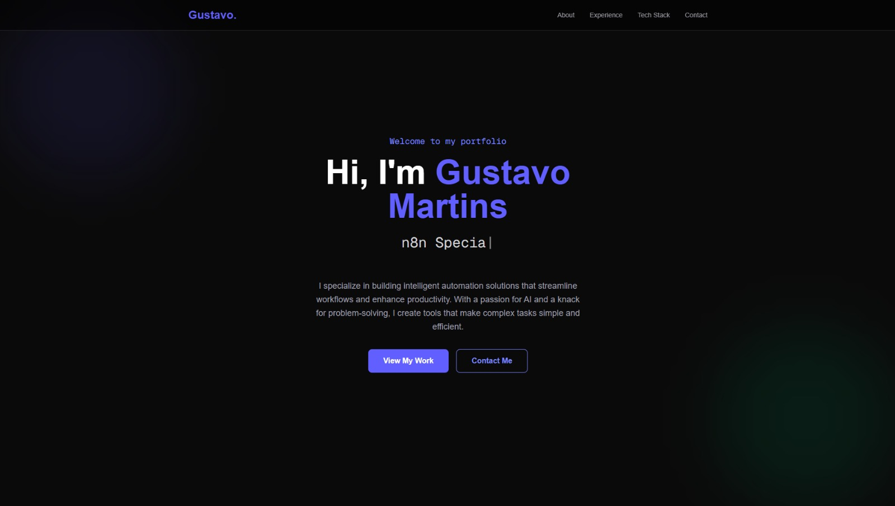
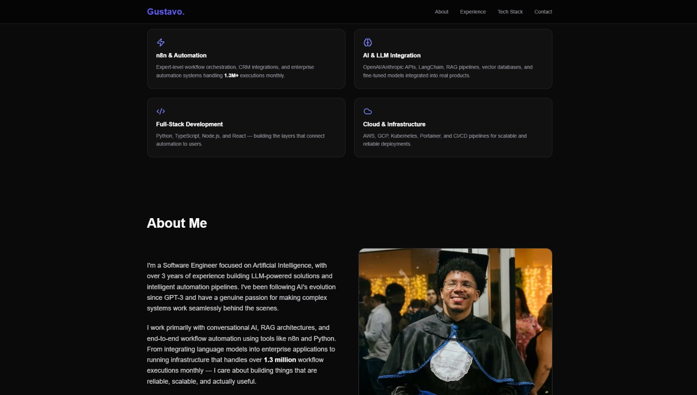
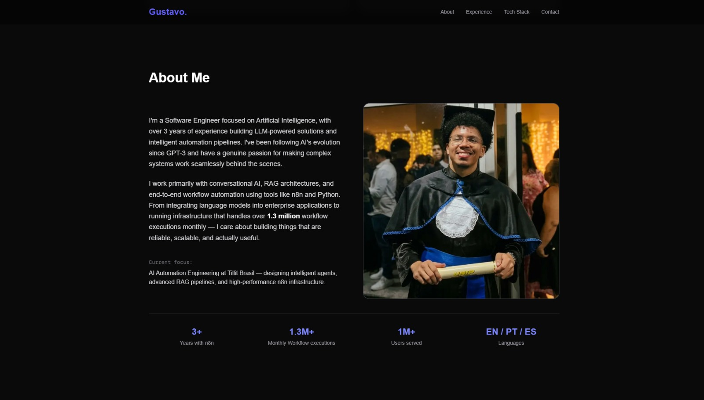
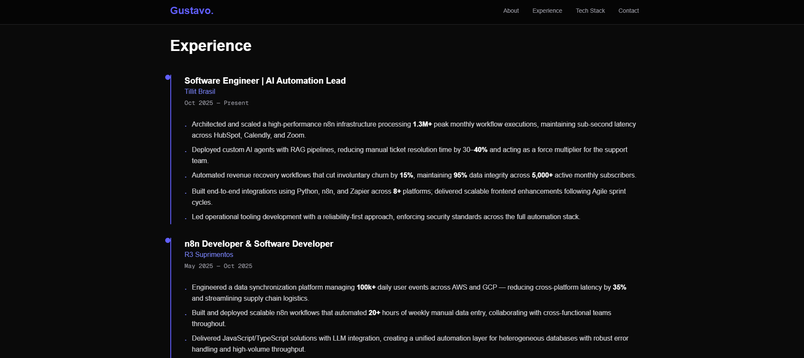
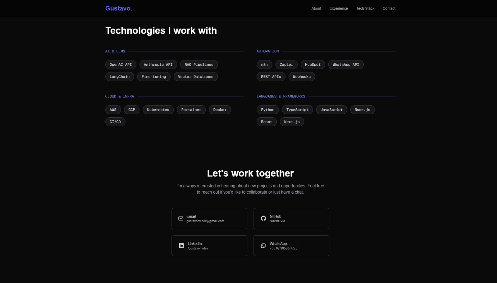

# Portfolio

A modern, responsive portfolio website built with Next.js, React, and Tailwind CSS. Showcase your professional experience, skills, and projects in a sleek, interactive interface.

## Table of Contents

- [Features](#features)
- [Project Structure](#project-structure)
- [Prerequisites](#prerequisites)
- [Installation](#installation)
- [Running the Project](#running-the-project)
- [Building for Production](#building-for-production)
- [Tech Stack](#tech-stack)
- [Screenshots](#screenshots)
- [Contributing](#contributing)
- [License](#license)

## Features

- ⚡ **Fast & Responsive** - Built with Next.js 16 for optimal performance and SEO
- 🎨 **Modern Design** - Tailwind CSS for beautiful, responsive UI
- 📱 **Mobile Friendly** - Fully responsive design that works on all devices
- ✨ **Smooth Animations** - Fade-in effects and smooth scrolling interactions
- 🎯 **Component-Based** - Modular architecture for easy maintenance and updates
- 🔗 **Social Integration** - FontAwesome icons for social media links
- 📄 **Multiple Sections** - Hero, About, Experience, Specialties, Tech Stack, and Contact
- ⚙️ **TypeScript** - Full type safety and better development experience

## Project Structure

```
portfolio/
├── public/                 # Static assets
├── src/
│   ├── app/
│   │   ├── globals.css    # Global styles
│   │   ├── layout.tsx     # Root layout component
│   │   └── page.tsx       # Home page
│   ├── components/        # React components
│   │   ├── About.tsx      # About section
│   │   ├── Contact.tsx    # Contact section
│   │   ├── Experience.tsx # Work experience section
│   │   ├── Hero.tsx       # Hero banner section
│   │   ├── Navbar.tsx     # Navigation bar
│   │   ├── Specialties.tsx# Skills/specialties section
│   │   └── TechStack.tsx  # Technology stack showcase
│   └── hooks/
│       └── useFadeInOnScroll.ts # Custom hook for scroll animations
├── eslint.config.mjs      # ESLint configuration
├── next.config.ts         # Next.js configuration
├── postcss.config.mjs      # PostCSS configuration
├── tailwind.config.js      # Tailwind CSS configuration
├── tsconfig.json          # TypeScript configuration
├── package.json           # Project dependencies
└── README.md              # This file
```

## Prerequisites

Before you begin, ensure you have the following installed:

- **Node.js** (v18 or higher) - [Download](https://nodejs.org/)
- **npm** (v9 or higher) or **yarn**/**pnpm** - Included with Node.js

## Installation

1. **Clone the repository**

   ```bash
   git clone https://github.com/TavinHVM/portfolio.git
   cd portfolio
   ```

2. **Install dependencies**

   ```bash
   npm install
   ```

   Or if you prefer yarn:
   ```bash
   yarn install
   ```

   Or if you prefer pnpm:
   ```bash
   pnpm install
   ```

## Running the Project

### Development Server

Start the development server with hot-reload:

```bash
npm run dev
```

Then open [http://localhost:3000](http://localhost:3000) in your browser to view the portfolio.

The application will automatically reload as you make changes to the code.

### Production Build

Build the project for production:

```bash
npm run build
```

### Start Production Server

Run the production build:

```bash
npm start
```

### Linting

Check for code quality issues:

```bash
npm run lint
```

## Building for Production

To create an optimized production build:

```bash
npm run build
npm start
```

The app is now ready to be deployed to hosting platforms like Vercel, Netlify, or any Node.js-compatible host.

## Tech Stack

- **Framework**: [Next.js 16](https://nextjs.org/) - React framework for production
- **Language**: [TypeScript](https://www.typescriptlang.org/) - Type-safe JavaScript
- **UI Framework**: [React 19](https://react.dev/) - UI library
- **Styling**: [Tailwind CSS 4](https://tailwindcss.com/) - Utility-first CSS framework
- **Icons**: 
  - [FontAwesome](https://fontawesome.com/) - Icon library
  - [Lucide React](https://lucide.dev/) - Additional icons
- **Tooling**: 
  - [ESLint 9](https://eslint.org/) - Code linting
  - [PostCSS 4](https://postcss.org/) - CSS transformation

## Screenshots

### Hero Section


## Specialties Section


### About Section


### Experience Section


### Tech Stack and Contact Section



*Note: Create a `screenshots` folder in the root directory and add your images there.*


## Contributing

Contributions are welcome! If you'd like to improve this portfolio template:

1. Fork the repository
2. Create a feature branch (`git checkout -b feature/amazing-feature`)
3. Commit your changes (`git commit -m 'Add some amazing feature'`)
4. Push to the branch (`git push origin feature/amazing-feature`)
5. Open a Pull Request

## License

This project is open source and available under the MIT License.

---
